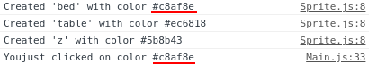

# How to make click Pixelperfect on Canvas

## Summary

There is no easy way to draw something and capture a pixel perfect click on it with HTML5 canvas. But there is a trick!

We can attribute a random color to each Sprite we create then on a new blank buffer canvas, draw all sprites but only with their respective colors. Capture mouse input coordonates on real canvas then look the color of the pixel on the buffer canvas then compare this color with your sprites. If colors matches you clicked on this sprite!

Tada! Real pixel perfect inputs!

## Initial Setup

I took 3 sprites.


So Basically here, we have a `Main` class which have an `Array` of Sprite(x, y, img) instances:
```javascript
this.sprites = [
  new Sprite(100, 100, this.imgs.bed),
  new Sprite(52, 146, this.imgs.table),
  new Sprite(80, 135, this.imgs.z)
]
```
*I had to set coordonates to make those sprites overlaping each other*

The class for Sprites is pretty simple:
```javascript
export default class Sprite {
  constructor(x, y, img) {
    this.x = x
    this.y = y
    this.img = img
  }
  render (ctx) {
    ctx.drawImage(this.img, this.x, this.y)
  }
}
```

For this example i didn't add a `z` or `depth` property to Sprites, we admit in this example that Sprites ordering is made by their position in array.
I set up a time loop to call render which call render on each Sprite:
```javascript
setInterval(() => this.render(), 1000 / 30)

...

render () {
  ...

  this.sprites.forEach( sprite => {
      sprite.render(this.ctx)
  })
}
```

Result:


## Real things coming up

First we need to generate a random color for each sprites and make a new method to render the image but with only one Color.

```javascript
constructor(x, y, img) {
  this.x = x
  this.y = y
  this.img = img
  this.name = this.img.id.replace('img-', '')
   // Return 'bed', 'table' or 'z'
  this.id = Math.floor(Math.random()*16777215).toString(16);
   // Return a random HEX Color
  console.log("Created '" + this.name + "' with color #" + this.id);
   //We want here to see what color is generated for this sprite
}
```

Console returns


Now we want to create a method `renderColor` with a canvas buffer, So we just need to create a canvas with img sizes, fill with generated color then drawImage with `destination-atop` composition.
```javascript
renderColor (ctx) {
  var buffer = document.createElement('canvas');
      buffer.width = this.img.width;
      buffer.height = this.img.height;
  var bx = buffer.getContext('2d');
  bx.fillStyle = '#' + this.id
  bx.fillRect(0,0,buffer.width,buffer.height);
  bx.globalCompositeOperation = "destination-atop";
  bx.drawImage(this.img,0,0);
  ctx.drawImage(buffer, this.x, this.y)
}
```

For debug purposes we can now see the result if we update the `render` to render those colors sprites:

```javascript
render () {
  this.sprites.forEach( sprite => {
      sprite.render(this.ctx)
      sprite.renderColor(this.ctx) //DEBUG
  })
}
```
Which give us this result:


Create a global buffer for all this color sprites in Main constructor and render color sprites to it instead of the real canvas

```javascript
this.inputCanvas = document.createElement('canvas')
this.inputCanvas.width = this.canvas.width
this.inputCanvas.height = this.canvas.width
this.inputCanvasCtx = this.inputCanvas.getContext('2d')

...

render () {
  this.sprites.forEach( sprite => {
      sprite.render(this.ctx)
      // Previously:  sprite.renderColor(this.ctx)
      sprite.renderColor(this.inputCanvasCtx)
  })
}
```

then add an event listener to the real canvas and get pixel informations on the buffer canvas

```javascript
this.canvas.addEventListener('click', event => {
  let color = this.inputCanvasCtx.getImageData(event.layerX, event.layerY, 1, 1).data
})
```

Convert the color data to HEX, and just compare with existing sprites!

```javascript
this.canvas.addEventListener('click', event => {
  let color = this.inputCanvasCtx.getImageData(event.layerX, event.layerY, 1, 1).data
  let hexColor = ("000000" + this.rgbToHex(color[0], color[1], color[2])).slice(-6)

  console.log('You just clicked on color #' + hexColor)

  let sprite = this.sprites.filter(sprite => sprite.id === hexColor)
  // You now have the sprite yea!
})

...

// RGB Util
rgbToHex(r, g, b) {
  if (r > 255 || g > 255 || b > 255)
      throw "Invalid color component"
  return ((r << 16) | (g << 8) | b).toString(16)
}
```

Console returns



You now have your clicked Sprite!

Thanks you guys for reading, hope this can help someone!

Léo DESIGAUX

[Link to the Project](https://github.com/Leoche/Pixelperfect-Click-Canvas)

[Link to my Website](https://leodesigaux.me)

[Link to my Twitter](https://twitter.com/le0che)

[Link to my Linkedin](https://www.linkedin.com/in/leodesigaux/)
